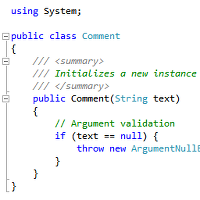

# VSEssentials #
----------------
A free and open source collection of essential Visual Studio extensions and utilities developed and distributed by Flatcode.net.

## Extensions ##
### Comment Formatter ###

The **Comment Formatter** extension provides additional formatting behavior for comments. The most prominent feature is the support for italicization, which can be configured for both normal and documentation comments individually.

Another feature is fading out of documentation tags. When enabled, all tags within a documentation comment will be displayed semitransparent instead of opaque, which makes them less obtrusive and turns the focus back on the content.

**[Official VSIX Package Download](http://download.flatcode.net/VSEssentials/CommentFormatter.vsix "CommentFormatter.vsix")** from [Flatcode.net](http://www.flatcode.net "Flatcode.net").

#### Feature Summary ####
- Fade Documentation Tags
- Italicized Comments
- Italicized Documentation Comments

#### Language Support ####
- English (United States)
- German (Germany)

#### Compatibility ####
- Visual Studio 2015 (all Editions)

