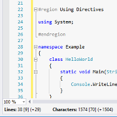
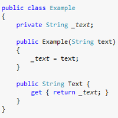

# VSEssentials #
A free and open source collection of essential Visual&nbsp;Studio&reg; extensions and utilities developed and distributed by Florian Schneidereit.

ARCHIVE NOTE: I dropped Windows as my development platform; that means, I no longer use Visual Studio and therefore will not continue development of these extensions. Feel free to fork this repository and/or reuse the code in your own projects.

## Extensions ##
### Comment Formatter ###
Download: **[Official VSIX Package (Current Release)](https://visualstudiogallery.msdn.microsoft.com/66521234-bd62-4e52-95a4-2ddbb225d081 "CommentFormatter.vsix")**

The **Comment Formatter** extension provides additional formatting behavior for source code comments. The most prominent feature is the support for italicization, which can be configured for ordinary and documentation comments individually.

Another feature is fading out of documentation tags. When enabled, all tags within a documentation comment will be displayed semitransparent instead of opaque, which makes them less obtrusive and turns the focus back on the content.

Last but not least, the formatting of multiline comments can be different from single-line comments.

#### Notes ####
The general configuration settings for this extension can be found in the Visual&nbsp;Studio&reg; Options dialog under *VSEssentials/Comment Formatter*. By default, documentation tags are faded and italicized, while italicization for comments is disabled.

The configuration of the formatting of multiline comments can be found in the "Fonts and Colors" category in the Visual&nbsp;Studio&reg; options dialog under the element name "Comments - Block". By default, multiline comments are in boldface.

#### Feature Summary ####
- Fade documentation tags
- Italicized comments
- Italicized documentation comments
- Boldface formatting for multiline comments

#### Language Support ####
- English
- German

#### Compatibility ####
- Visual&nbsp;Studio&reg; 2015 (all Editions)
- Visual&nbsp;Studio&reg; 2017 (all Editions) until version 15.7

### Document Insights ###
The **Document Insights** extension displays additional document information in a margin at the bottom of the text editor. This includes more detailed information about lines and characters: first, the actual (current) count, followed by the original (source) count in angle brackets, and the difference in round brackets at the end.

#### Notes ####
The configuration settings for this extension can be found in the Visual&nbsp;Studio&reg; Options dialog under *VSEssentials/Document Insights*. By default, the document insights margin is visible and displays both line and character information.

#### Feature Summary ####
- Line information: Actual (current) and original (source) count, and difference
- Character information: Actual (current) and original (source) count, and difference
- Encoding information

#### Language Support ####
- English
- German

#### Compatibility ####
- Visual&nbsp;Studio&reg; 2015 (all Editions)

### Insert GUID Command ###
The **Insert GUID Command** extension provides a quick way to insert a new GUID string in the text editor.

### Notes ###
The command to insert a new GUID string can be found in the *Advanced* sub-menu of the *Edit* menu in the Visual&nbsp;Studio&reg; IDE. It can also be executed via the keyboard shortcut "Ctrl+Shift+G".

#### Language Support ####
- English
- German

#### Compatibility ####
- Visual&nbsp;Studio&reg; 2015 (all Editions)

### Semantic Formatter ###
The **Semantic Formatter** extension provides additional formatting for C# and Visual Basic source code. When enabled, field identifiers are italicized to make them easier distinguishable from arguments and local variables. Further, method identifiers are in boldface, and italicized if it is an extension method.

#### Notes ####
The semantic formatting can be configured using the "Fonts and Colors" category in the Visual&nbsp;Studio&reg; IDE options dialog. Look for element names that start with "Semantic Formatting".

#### Feature Summary ####
- Italicized field identifiers
- Bold method identifiers, italicized for extension methods

#### Language Support ####
- English
- German

#### Compatibility ####
- Visual&nbsp;Studio&reg; 2015 (all Editions)
